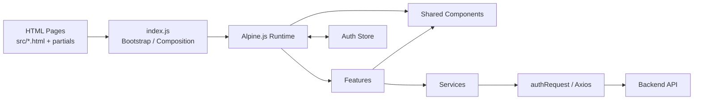
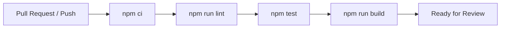

# Infinite Track — Web Frontend

**Infinite Track** adalah sistem presensi digital yang dikembangkan untuk mendukung pengelolaan kehadiran pada pola kerja WFO, WFH, dan WFA di Infinite Learning.

Repository ini berisi **Web Frontend Infinite Track** yang digunakan sebagai dashboard monitoring, pengelolaan, dan pelaporan data presensi.

## Repository

| Item               | Value                                   |
| ------------------ | --------------------------------------- |
| Repository         | `Infinite-LearningV1/Infinite_Track_Fe` |
| Integration branch | `develop`                               |
| Production branch  | `master`                                |
| Runtime            | Static multi-page frontend              |
| Node.js            | `24+`                                   |

This repository requires Node.js 24+.

## Tech Stack

- HTML
- JavaScript
- Alpine.js
- Tailwind CSS
- Webpack 5
- Axios
- Leaflet
- Chart.js / ApexCharts
- jsPDF / XLSX

## Getting Started

```bash
git clone https://github.com/Infinite-LearningV1/Infinite_Track_Fe.git
cd Infinite_Track_Fe
git checkout develop
npm ci
cp .env.example .env
npm run start
```

### Local runtime boundary

Web FE runs directly on Webpack Dev Server at `http://localhost:3000`.
The backend is started independently from the backend repository and must listen on `http://localhost:3005` for the default local integration path.
Webpack proxies browser requests under `/api/*` to that backend target, so local browser code keeps `API_BASE_URL=/api`.

Web FE does not require Nginx, Docker Compose, or a Web FE-owned backend container for canonical local development.

## Environment

`.env.example` is the single public-safe template. It contains the seven retained public build/dev inputs: `API_BASE_URL`, `APP_ENVIRONMENT`, `DEBUG_MODE`, `LOG_LEVEL`, `WEBPACK_DEV_HOST`, `WEBPACK_OPEN`, and `WEBPACK_API_PROXY_TARGET`. Authentication paths, session durations, app identity, and locale defaults are code-level constants.

For a static production build, the deployment platform supplies the public values: `API_BASE_URL=https://api.infinite-track.tech/api`, `APP_ENVIRONMENT=production`, `DEBUG_MODE=false`, and `LOG_LEVEL=error`. Do not commit a production env file.

## Commands

| Command         | Purpose                                       |
| --------------- | --------------------------------------------- |
| `npm ci`        | Install dependencies from `package-lock.json` |
| `npm run start` | Start development server                      |
| `npm run lint`  | Check repository formatting                   |
| `npm test`      | Run full regression test suite                |
| `npm run build` | Create production build                       |

## Project Structure

```text
Infinite_Track_Fe/
├── .github/
│   └── workflows/
│       └── ci.yml        # CI verification workflow
├── docs/
│   └── adr/              # Architecture Decision Records
├── src/
│   ├── js/
│   │   ├── components/
│   │   ├── config/
│   │   ├── features/
│   │   ├── services/
│   │   ├── stores/
│   │   └── utils/
│   ├── partials/
│   ├── images/
│   └── *.html
├── tests/                # Regression tests by domain
├── .env.example          # Single public build/dev input template
├── .gitattributes        # LF working-tree policy
├── .prettierrc           # Repository formatting policy
├── postcss.config.js     # PostCSS configuration owner
├── webpack.config.js     # Webpack build and local dev-server config
└── package.json
```

## Frontend Architecture



## Branch Workflow

```text
feature/* ─┐
fix/*     ─┼─> develop ──> master
chore/*   ─┘
```

## CI & Verification



The repository verification workflow is [`.github/workflows/ci.yml`](.github/workflows/ci.yml).

## Deployment

| Item             | Value                                 |
| ---------------- | ------------------------------------- |
| Release branch   | `master`                              |
| Build command    | `npm ci && npm run build`             |
| Output directory | `build/`                              |
| Frontend         | `https://infinite-track.tech`         |
| API base         | `https://api.infinite-track.tech/api` |
| Hosting model    | DigitalOcean App Platform Static Site |
| Backend ingress  | Backend-owned Nginx at `api.infinite-track.tech` |

```text
develop
   ↓
master
   ↓
production build
   ↓
deploy build/
```

The Web FE production artifact is static `build/` content. The Web FE repository does not own a production Nginx runtime. Browser API traffic goes directly to `https://api.infinite-track.tech/api`; backend ingress/TLS remains a backend responsibility.

## License

Repository menggunakan MIT License. Lihat [`LICENSE`](LICENSE).
