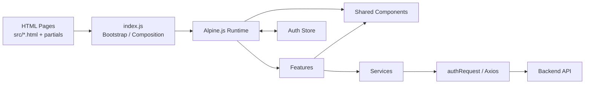
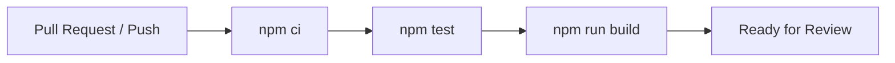

# Infinite Track — Web Frontend

**Infinite Track** adalah sistem presensi digital yang dikembangkan untuk mendukung pengelolaan kehadiran pada pola kerja WFO, WFH, dan WFA di Infinite Learning.

Repository ini berisi **Web Frontend Infinite Track** yang digunakan sebagai dashboard monitoring, pengelolaan, dan pelaporan data presensi.

## Repository

| Item               | Value                                   |
| ------------------ | --------------------------------------- |
| Repository         | `Infinite-LearningV1/Infinite_Track_Fe` |
| Integration branch | `develop`                               |
| Production branch  | `master`                                |
| Runtime            | Static multi-page frontend              |
| Node.js            | `20+`                                   |

## Tech Stack

- HTML
- JavaScript
- Alpine.js
- Tailwind CSS
- Webpack 5
- Axios
- Leaflet
- Chart.js / ApexCharts
- jsPDF / XLSX

## Getting Started

```bash
git clone https://github.com/Infinite-LearningV1/Infinite_Track_Fe.git
cd Infinite_Track_Fe
git checkout develop
npm ci
cp .env.example .env
npm run start
```

## Environment

| Variable            | Development      | Production                            |
| ------------------- | ---------------- | ------------------------------------- |
| `API_BASE_URL`      | `/api`           | `https://api.infinite-track.tech/api` |
| `API_AUTH_ENDPOINT` | `/auth`          | `/auth`                               |
| `API_VERSION`       | `v1`             | `v1`                                  |
| `APP_NAME`          | `Infinite Track` | `Infinite Track`                      |
| `APP_VERSION`       | `2.0.1`          | `2.0.1`                               |
| `APP_ENVIRONMENT`   | `development`    | `production`                          |
| `SESSION_TIMEOUT`   | `3600000`        | `3600000`                             |
| `REMEMBER_ME_DAYS`  | `7`              | `7`                                   |
| `DEFAULT_LANGUAGE`  | `id`             | `id`                                  |
| `TIMEZONE`          | `Asia/Jakarta`   | `Asia/Jakarta`                        |
| `DEBUG_MODE`        | `true`           | `false`                               |
| `LOG_LEVEL`         | `info`           | `error`                               |

## Commands

| Command         | Purpose                                       |
| --------------- | --------------------------------------------- |
| `npm ci`        | Install dependencies from `package-lock.json` |
| `npm run start` | Start development server                      |
| `npm test`      | Run full regression test suite                |
| `npm run build` | Create production build                       |

## Project Structure

```text
Infinite_Track_Fe/
├── .github/              # GitHub Actions
├── docs/
│   └── adr/              # Architecture Decision Records
├── src/
│   ├── js/
│   │   ├── components/
│   │   ├── config/
│   │   ├── features/
│   │   ├── services/
│   │   ├── stores/
│   │   └── utils/
│   ├── partials/
│   ├── images/
│   └── *.html
├── tests/                # Regression tests by domain
├── .env.example
├── .env.production.example
├── webpack.config.js
└── package.json
```

## Frontend Architecture



## Branch Workflow

```text
feature/* ─┐
fix/*     ─┼─> develop ──> master
chore/*   ─┘
```

## CI & Verification



## Deployment

| Item             | Value                                 |
| ---------------- | ------------------------------------- |
| Release branch   | `master`                              |
| Build command    | `npm ci && npm run build`             |
| Output directory | `build/`                              |
| Frontend         | `https://infinite-track.tech`         |
| API base         | `https://api.infinite-track.tech/api` |

```text
develop
   ↓
master
   ↓
production build
   ↓
deploy build/
```

## License

Repository menggunakan MIT License. Lihat [`LICENSE`](LICENSE).
